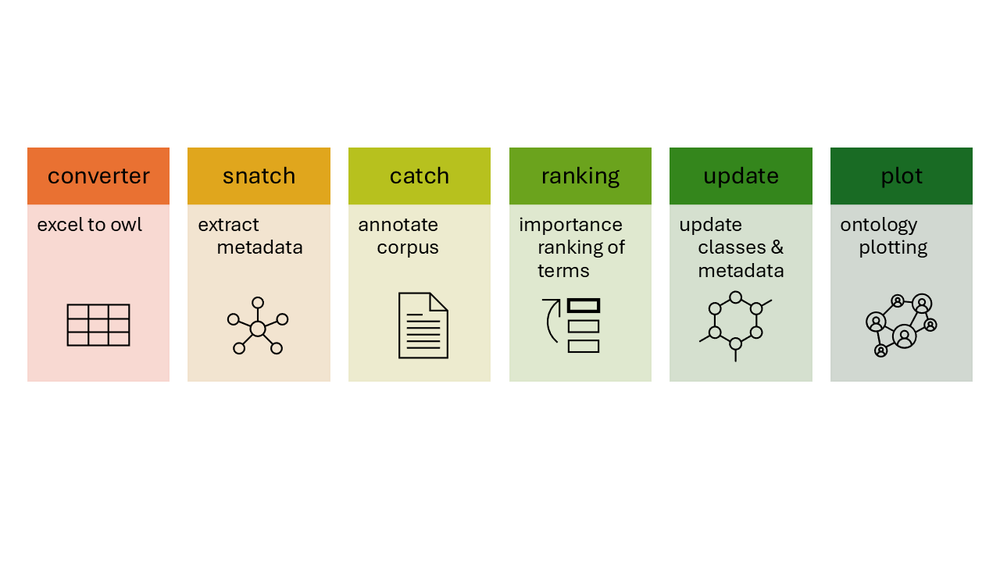

An ontology is a knowledge representation framework that is machine readable.
It facilitates logical relationships between classes and allows us to standardise - and formalise - vocabulary within a domain.
The metadata contained within an ontology is valuable with research showing can address the challenges presented by unstructured text.

Unstructured text can be processed, mined, and empowered by Natural Language Processing (NLP) tools, yet majority of tools are not designed to consider ontologies.

**Jabberwocky** allows users to conduct various NLP tasks whilst easily manipulating ontologies.
Here provides an explanation - with a working example - for the Jabberwocky toolkit. 

**Documentation** is linked in the table below:

|  | function | description | documentation
| --- | --- | --- | --- |
| 1. | `converter` | convert an excel to an ontology | [docs](https://github.com/sap218/jabberwocky/tree/master/01_converter)
| 2. | `snatch metadata` | extract metadata from classes | [docs](https://github.com/sap218/jabberwocky/tree/master/02_snatch_metadata)
| 3. | `catch text` | annotate corpus with key terms/phrases | [docs](https://github.com/sap218/jabberwocky/tree/master/03_catch_text)
| 4. | `rank terms` | rank terms in order of importance | [docs](https://github.com/sap218/jabberwocky/tree/master/04_rank_terms)
| 5. | `update entities` | update ontology with new classes and metadata | [docs](https://github.com/sap218/jabberwocky/tree/master/05_update_entities)
| 6. | `ontology plotting` | plot an ontology via web or tree format | [docs](https://github.com/sap218/jabberwocky/tree/master/06_ontology_plot)

When combining these Jabberwocky functions, users can create an **NLP** workflow:



**Scenario**

You have curated unstructured text: user-generated posts from a social media platform (with permission of course, in this example I invented these fake conversations).

Your aim is to text mine the corpus and only have posts covering a particular topic (or set of topics).
But you realise, although you know some words in this topic of yours, you may be missing some important semantics.

This is where **ontologies are useful**. Ontologies are a controlled set of vocabularies with metadata, for example: synonyms.

1. You decide to design an ontology in excel and then use `converter` to make it into an ontology.

2. Of all the words in the ontology, some are vital to your research, you can `snatch the metadata` from the ontology to extract concepts of interest and their synonyms.

3. With these concepts and synonyms, you can annotate your corpus (social media data) to `catch` the posts that had these terms - this is great for downstream analysis! BUT...you also output a version of the corpus without annotations as you are curious if anything of interest was here...

4. With the version of "nothing annotated", you proceed to investigate with `ranking terms`, this statistical techique highlights "important" terms in context of frequency in the corpus. With this output, you've found new synonyms and perhaps even terms that highlight a new class for your ontology.

5. Organising these new entities (classes or metadata), we can `update` the ontology.

6. Finally, you rerun (2) `snatch` to update your concepts list, and rerun (3) `catch` for more annotations: meaning a more fruitful output for your investigations.

---

**Useful links**
+ GitHub repository for [Jabberwocky](https://github.com/sap218/jabberwocky)
+ GitHub repository for the test files, [CelestialObject](https://github.com/sap218/CelestialObject)
+ An introduction to ontologies and space being a practical example, [the Space Ontology and a Beginners Guide to Ontologies](https://sap218.uk/posts/celestialobject/)
+ Software for ontology editing, [Protégé](https://protege.stanford.edu/)
+ Annotation was developed based on spaCy's [PhraseMatcher](https://spacy.io/api/phrasematcher)
+ Wikipedia article for [TF-IDF](https://en.wikipedia.org/wiki/Tf%E2%80%93idf)
+ Jabberwocky was published in [JOSS](https://doi.org/10.21105/joss.02168), you can cite here:

```
@article{Pendleton2020,
  doi = {10.21105/joss.02168},
  url = {https://doi.org/10.21105/joss.02168},
  year = {2020},
  publisher = {The Open Journal},
  volume = {5},
  number = {51},
  pages = {2168},
  author = {Samantha C. Pendleton and Georgios V. Gkoutos},
  title = {Jabberwocky: an ontology-aware toolkit for manipulating text},
  journal = {Journal of Open Source Software}
}
```

***

End of document
